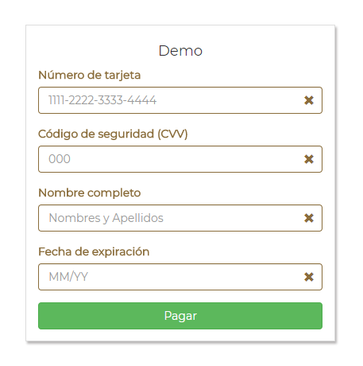

# Validador de datos de Tarjeta de Crédito
+ __Integrantes:__ *Melyna Pernia y Milagros Palma*
## ¿Qué es?
Es una librería que valida el número de tarjeta de crédito (usando algoritmo de Luhn), fecha de vencimiento, codigo de verificación (cvv) y nombre completo que aparece en la tarjeta.

## ¿Cómo nos organizamos?
Para la elaboración del presente proyecto se realizó la siguiente tabla donde definimos las actividades a realizar:

| N°  | Actividad |
| ---------- | ---------- |
| 1 | Elegir el reto                                             |
| 2 | Hacer fork del reto modelo                                 |
| 3 | Estructurar el proyecto e instalar la herramienta babel    |
| 4 | Investigar acerca de las librerías                         |
| 5 | Realizar el diseño del formulario en el index              |
| 6 | Programar la funcionalidad en la versión ES6 de javascript |

## ¿Cómo funciona la librería?
La librería debe recibir una referencia a un elemento del DOM que contenga `<input>`s con los siguientes nombres (atributo `name`):

* `cn` (Card Number): El número de la tarjeta de crédito
* `name`: Nombre completo como aparece en la tarjeta
* `cvv` (Card Verification Value): Código de validación de 3 dígitos
* `exp` (Expiry Date): Fecha de expiración

A la hora de hacer las validaciones, la librería añade la clase `.has-error` a los `<input>`s que no pasen la validación, o la clase `.has-success` en caso de que sí pase.

## ¿Cómo trabajar con la librería?
Para fines prácticos de la implementación, indicamos las sguientes instrucciones:
1. Fork al [repositorio](https://github.com/milagrospalma/card-validator)
2. Cada input valida, por lo que las validaciones se presentan en funciones para que solo las llame cuando ocurre cierto evento. Un ejemplo sería este bloque de código que corresponde a una función:
````
  /*La función cardNumberLength tiene un parámetro de entrada inputValue*/

  const cardNumberLength = inputValue => {
    if (inputValue.trim().length === 16) {
      return inputValue;
    }
  };
````
4. Tener en cuenta el Framework que se use. para este demo usamos Bootsrtap, que ya cuenta con las clases `.has-error` y
`.has-success`.

## Vista demo


## Herramientas
`HTML5` `CSS3` `JavaScript` `jQuery` `Bootstrap`
