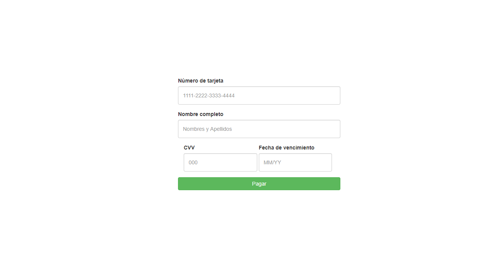

# Validador de datos de Tarjetas de Crédito
## Objetivo
Implementar un validador de datos de tarjeta de crédito. La librería debería validar el número de tarjeta de crédito (usando algoritmo de Luhn), fecha de vencimiento, codigo de verificación (cvv) y nombre completo que aparece en la tarjeta.

## Descripción
...

## Vista demo

## Herramientas
`HTML5` `CSS3` `JavaScript` `jQuery` `Bootstrap`
